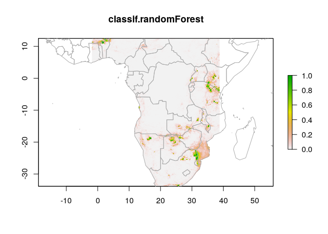

[](https://doi.org/10.5281/zenodo.1436376)
[](https://doi.org/10.21105/joss.00847)

# sdmbench


Species Distribution Modeling (SDM) is a field of increasing importance
in ecology<sup>[1](#footnote1)</sup>. Several popular applications of
SDMs are understanding climate change effects on
species<sup>[2](#footnote2)</sup>, natural reserve
planning<sup>[3](#footnote3)</sup> and invasive species
monitoring<sup>[4](#footnote4)</sup>. The `sdmbench` package solves
several issues related to the development and evaluation of those models
by providing a consistent benchmarking workflow:

- consistent species occurrence data acquisition and preprocessing
- consistent environmental data acquisition and preprocessing (both
  current data and future projections)
- consistent spatial data partitioning
- integration of a wide variety of machine learning models
- graphical user interface for non/semi-technical users

The end result of a `sdmbench` SDM analysis is to determine the
model–data processing combination that results in the highest predictive
power for the species of interest. Such an analysis is useful to
researchers who want to avoid issues of model selection and evaluation,
and want to rapidly test prototypes of species distribution models.

## Installation

``` r
# add build_vignettes = TRUE if you want the package vignette
devtools::install_github("boyanangelov/sdmbench")
```

The package has two optional dependencies for full functionality:

**Deep learning (Keras/TensorFlow).** Requires a working Python
installation.

``` r
# consult the keras documentation for GPU support
keras::install_keras()
```

**MaxEnt.** Requires Java and `maxent.jar` placed in the dismo Java
directory. See `?dismo::maxent` for installation instructions.

## Examples

Download and prepare benchmarking data:

``` r
library(sdmbench)
#> sdmbench: Tools for benchmarking Species Distribution Models
#> ============================================================
#> For more information visit https://github.com/boyanangelov/sdmbench
#> To start the GUI: run_sdmbench()

benchmarking_data <- get_benchmarking_data("Loxodonta africana", limit = 1200, climate_resolution = 10)
#> Downloading occurrence data from GBIF...
#> Cleaning coordinates...
#> Downloading climate data...
#> Done!

head(benchmarking_data$df_data)
#>   bio1 bio2 bio3 bio4 bio5 bio6 bio7 bio8 bio9 bio10 bio11 bio12 bio13
#> 1  181  132   59 3078  283   60  223  187  141   220   141   425    48
#> 2  180  142   58 3336  292   51  241  210  136   222   136   410    50
#>   bio14 bio15 bio16 bio17 bio18 bio19 label
#> 1    25    19   122    87   114    87     1
#> 2    21    24   122    73   121    73     1
```

Apply spatial partitioning and set up learners:

``` r
benchmarking_data$df_data <- partition_data(
    dataset_raster = benchmarking_data$raster_data,
    dataset        = benchmarking_data$df_data,
    env            = benchmarking_data$raster_data$climate_variables,
    method         = "block"
)

learners <- list(
    mlr3::lrn("classif.ranger",  predict_type = "prob"),
    mlr3::lrn("classif.log_reg", predict_type = "prob"),
    mlr3::lrn("classif.rpart",   predict_type = "prob"),
    mlr3::lrn("classif.svm",     predict_type = "prob")
)

benchmarking_data$df_data <- na.omit(benchmarking_data$df_data)
```

Benchmark models and retrieve results:

``` r
bmr <- benchmark_sdm(benchmarking_data$df_data,
                     learners     = learners,
                     dataset_type = "block",
                     sample       = FALSE)

best_results <- get_best_model_results(bmr)
best_results
#> # A tibble: 4 × 3
#>   learner_id       iteration classif.auc
#>   <chr>                <int>       <dbl>
#> 1 classif.ranger           1       0.992
#> 2 classif.log_reg          2       0.915
#> 3 classif.rpart            3       0.900
#> 4 classif.svm              4       0.963
```

Plot the best model's predicted habitat suitability:

``` r
plot_sdm_map(raster_data = benchmarking_data$raster_data,
             bmr         = bmr,
             learner_id  = best_results$learner_id[1],
             iteration   = best_results$iteration[1],
             map_type    = "static")
```



## Using custom data

If you prefer to bring your own occurrence data rather than downloading
from GBIF, you can upload a CSV via the Shiny GUI sidebar. The file must
have the following columns:

| species    | decimalLongitude | decimalLatitude |
|------------|-----------------|----------------|
| Lynx lynx  | 24.3            | 51.2           |
| …          | …               | …              |

Custom data is currently supported only for **General Models** and does
not include mapping functionality.

A good starting point to explore the full package is to launch the GUI:

``` r
run_sdmbench()
```

Screenshots:


<br><br>


## Vignette

A thorough introduction to the package is available as a vignette in the
package, and
[online](https://boyanangelov.com/materials/sdmbench_vignette.html).

``` r
vignette("sdmbench")
```

## Tests

Tests are in the `tests/` directory and can be run with:

``` r
devtools::test()
```

or Ctrl/Cmd + Shift + T in RStudio. Note that tests download live data
from GBIF and require an internet connection.

## Contributors

Contributions are welcome and guidelines are stated in `CONTRIBUTING.md`.

## License

MIT (`LICENSE.md`)

## References

<a name="footnote1">1</a>. Elith, J. & Leathwick, J. R. Species
Distribution Models: Ecological Explanation and Prediction Across Space
and Time. *Annu. Rev. Ecol. Evol. Syst.* 40, 677–697 (2009).

<a name="footnote2">2</a>. Austin, M. P. & Van Niel, K. P. Improving
species distribution models for climate change studies: Variable
selection and scale. *J. Biogeogr.* 38, 1–8 (2011).

<a name="footnote3">3</a>. Guisan, A. et al. Predicting species
distributions for conservation decisions. *Ecol. Lett.* 16, 1424–1435
(2013).

<a name="footnote4">4</a>. Descombes, P. et al. Monitoring and
distribution modelling of invasive species along riverine habitats at
very high resolution. *Biol. Invasions* 18, 3665–3679 (2016).
