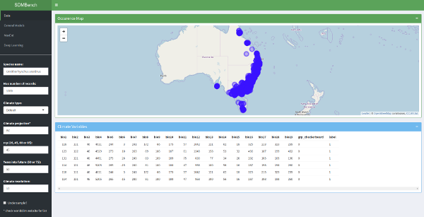
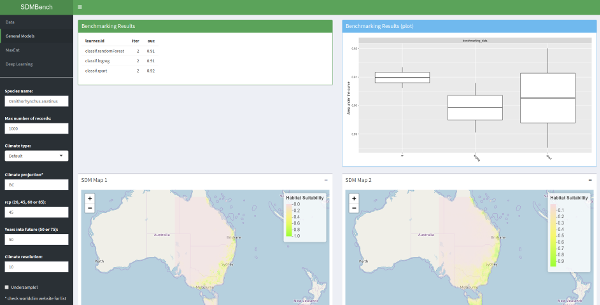

```{r setup, include = FALSE}
knitr::opts_chunk$set(
  collapse = TRUE,
  comment = "#>"
)

keras::install_keras(tensorflow = "default")
```


## Introduction

Species Distribution Modeling (SDM), or Environmental Niche Modeling, is a field of great importance in ecology. Several popular applications of SDMs are in estimating climate change effects on species, natural reserve planning and invasive species dispersal predictions[^1]. Those models are trained by using a species occurence dataset (containing geographical coordinates of the observation locations) and associated environmental variables. The latter can be many and domain expertise is required to select the optimal ones. In most cases a set of "bioclimactic" variables can be successfully used. The [Worldclim website](http://www.worldclim.org/bioclim) provides a description:

> Bioclimatic variables are derived from the monthly temperature and rainfall values in order to generate more biologically meaningful variables. These are often used in species distribution modeling and related ecological modeling techniques. The bioclimatic variables represent annual trends (e.g., mean annual temperature, annual precipitation) seasonality (e.g., annual range in temperature and precipitation) and extreme or limiting environmental factors (e.g., temperature of the coldest and warmest month, and precipitation of the wet and dry quarters). A quarter is a period of three months (1/4 of the year).

On the website there is also a list describing the variables, but for ease of access we include it here as well.

| Name | Description |
|:------|:-----|
|BIO1| Annual Mean Temperature |
|BIO2| Mean Diurnal Range (Mean of monthly (max temp - min temp)) |
|BIO3| Isothermality (BIO2/BIO7) (* 100) |
|BIO4| Temperature Seasonality (standard deviation *100) |
|BIO5| Max Temperature of Warmest Month |
|BIO6| Min Temperature of Coldest Month |
|BIO7| Temperature Annual Range (BIO5-BIO6) |
|BIO8| Mean Temperature of Wettest Quarter |
|BIO9| Mean Temperature of Driest Quarter |
|BIO10| Mean Temperature of Warmest Quarter |
|BIO11| Mean Temperature of Coldest Quarter |
|BIO12| Annual Precipitation |
|BIO13| Precipitation of Wettest Month |
|BIO14| Precipitation of Driest Month |
|BIO15| Precipitation Seasonality (Coefficient of Variation) |
|BIO16| Precipitation of Wettest Quarter |
|BIO17| Precipitation of Driest Quarter |
|BIO18| Precipitation of Warmest Quarter |
|BIO19| Precipitation of Coldest Quarter |

To model the effects of climate change into the future we can use the [CMIP5 dataset](http://worldclim.org/CMIP5v1). For more information on how to do that in `sdmbench` consult the documentation: `?get_benchmarking_data`. In this vignette we will be relying on current bioclim features exclusively, but the workflow for CMIP5 is very similar.

## Motivation

R has been widely adopted as a language for ecological modeling work. This is in major part due to the multitude of packages already written by researchers and practitioners. Machine learning in R has also been making steady improvements recently with the development of packages such as `mlr`, `keras` and many other [tidyverse](https://www.tidyverse.org/) ones, which provide more consistent and user-friendly APIs[^4]. This large collection of open source tools has one negative side effect - tooling selection. Additionally, the comparison of different modeling techniques is hindered due to differences in data processing and/or different algorithm implementations between packages.

There are several studies and packages that have grappled with this problem[^6],[^7]. Unfortunately those solutions do not cover all (even most) possible scenarios and are not taking advantage of the newer machine learning packages.

The main features of `sdmbench` are:

* consistent species occurence data acquisition and preprocessing
* consistent environmental data acquisition and preprocessing
* consistent spatial data partitioning
* integration of a wide variety of machine learning models (standard and deep learning)
* graphical user interface for non/semi-technical users

By achieving those goals `sdmbench` increases the reproducibility of SDM research, makes method selection easier and provides a consistent testing environment for the development of new machine learning models.

## Installation

The package can be installed from Github: `devtools::install_github("boyanangelov/sdmbench", build_vignettes = TRUE)`{.r}. If the installation has been completed successfuly you should see a welcome message in your R console.

```{r}
library(sdmbench)
```

## Data Download

In this tutorial we will be building and benchmarking SDMs for the [platypus](http://eol.org/pages/323858/overview) (*Ornithorhynchus anatinus*). This animal is especially convenient since we can already make a few assumptions of its distribution. For example we can assume it is more widely present in the coastal areas of Australia (around Melbourne and Sydney), since those have a more humid/subtropical climate.

As a first step we need to download the occurence data and the associated environmental variables. The `get_benchmarking_data` function connects to [GBIF](https://www.gbif.org/) and downloads all human[^2] observations of the queried species. While additional data points are available (consult the `occ_search` documentation with `?rgbif::occ_search`), for our purposes we are interested in the geographic coordinates of the observations only.

As parameters for this function we need to specify the scientific name of the species, how many maximum occurences we want and the resolution of the environmental data. Note that if you are running this for the first time, a folder called `wc10`[^3] will be created in the working directory. This process can also take a while the first time since the data is downloaded. Under the hood `sdmbench` also uses the [scrubr](https://github.com/ropensci/scrubr) package to clean up the occurences.

```{r}
benchmarking_data <- get_benchmarking_data("Ornithorhynchus anatinus", limit = 1200, climate_resolution = 10)
```

The `benchmarking_data` list contains several datasets which we need for benchmarking. Let's have a look at each one.

```{r}
head(benchmarking_data$df_data)
```

Here we can see the actual values of the environmental features. This dataframe enables the application of more advanced machine learning models (i.e. learners from `mlr`), and not only [profile/domain specific models](http://rspatial.org/sdm/rst/6_sdm_methods.html#profile-methods) (such as MaxEnt, Mahalanobis distance and Domain[^8]) that work with raster data only. Still, we will need the raster data for plotting and comparison to MaxEnt. Those data points are stored in the `benchmarking_data$raster_data` object.

## Data visualisation

It is a good practice to plot data before further analysis. In this way data errors can be uncovered early in the analysis, or you can even generate some hypotheses. In our case we can plot the environmental variables together with the occurence coordinates.

```{r fig.height=4, fig.width=4, message=FALSE, warning=FALSE}
data("wrld_simpl", package = "maptools")
raster::plot(benchmarking_data$raster_data$climate_variables$bio1, main = "Bio1 (Annual Mean Temperature)", legend=FALSE) +
                                         points(benchmarking_data$raster_data$coords_presence,
                                                col = "red", cex=0.75, pch = 10) +
                                         raster::plot(wrld_simpl, add = TRUE, border = "darkgrey")

```

```{r fig.height=4, fig.width=4}
raster::plot(benchmarking_data$raster_data$climate_variables$bio2, main = "Bio2 (Mean Diurnal Range)", legend=FALSE) +
                                         points(benchmarking_data$raster_data$coords_presence,
                                                col = "red", cex=0.75, pch = 10) +
                                         raster::plot(wrld_simpl, add = TRUE, border = "darkgrey")
```


```{r fig.height=4, fig.width=4}
raster::plot(benchmarking_data$raster_data$climate_variables$bio4, main = "Bio4 (Temperature Seasonality)", legend=FALSE) +
                                         points(benchmarking_data$raster_data$coords_presence,
                                                col = "red", cex=0.75, pch = 10) +
                                         raster::plot(wrld_simpl, add = TRUE, border = "darkgrey")
```

Those plots already demonstrate how climate can be influential in determining species distribution. Most of the occurences are scattered around the coastal areas, where the climate is more forgiving. It is important that you keep in mind that those occurences are human observations, thus there will always be a the tendency for them to be more prevalent in more populated areas (due to the ease of access for human observers).

## Data processing

Next we should partition the data in a way that is meaningful for training SDMs. Data partitioning is an important topic in machine learning because it allows us to evaluate and compare models. SDMs can be improved by using domain specific partitioning techniques. THose can help avoid issues such as [spatial autocorrelation](http://rspatial.org/analysis/rst/3-spauto.html). Many are available in the `ENMeval` package. For more information you can consult the [ENMeval vignette](https://cran.r-project.org/web/packages/ENMeval/vignettes/ENMeval-vignette.html). The `partition_data` function does most of the heavy lifting:

```{r}
benchmarking_data$df_data <- partition_data(dataset_raster = benchmarking_data$raster_data,
                                            dataset = benchmarking_data$df_data,
                                            env = benchmarking_data$raster_data$climate_variables,
                                            method = "block")
```

Let's have a look at the changes.

```{r}
head(benchmarking_data$df_data)
```

We can see that now we have two more columns - `label` and `grp`. The `label` is used by the supervised learning methods we will be benchmarking, and the `grp` variable is specifying the data partitioning groups.

## Bechmarking

The current `sdmbench` version supports 10 popular machine learning methods:

* Random Forests
* Logistic Regression
* Decision Trees
* Support Vector Machines
* Gradient Boosting Machine
* Ada Boosting
* Multinomial Regression
* eXtreme Gradient Boosting
* Naive Bayes
* K-Nearest Neighbours

Let's select a few. In this step it is important to specify the `predict.type` as `"prob"` since we will be later plotting the probabilities on the map - they are more ecologically interpretable than binary presence/absence.

```{r}
learners <- list(mlr::makeLearner("classif.randomForest", predict.type = "prob"),
                 mlr::makeLearner("classif.logreg", predict.type = "prob"),
                 mlr::makeLearner("classif.rpart", predict.type = "prob"),
                 mlr::makeLearner("classif.ksvm", predict.type = "prob"))
```

Now we are ready to start the benchmarking process. The `benchmark_sdm` function needs the same `dataset_type` as the partitioning `method` in `partition_data`. The additional `sample` argument we can specify if we want to undersample the occurences. This can be interesting if we want to select a method that works well with a limited number observations.

```{r}
bmr <- benchmark_sdm(benchmarking_data$df_data, learners = learners, dataset_type = "block", sample = FALSE)
```

The text output already contains a few interesting results, most importantly the area under the curve (AUC). We will be using this metric to compare the models. Let's summarize the best results per model:

```{r}
best_results <- get_best_model_results(bmr)
best_results
```

Here we can see that `randomForest` is the best performing algorithm. This dataframe can then be used to extract the best model and plot its predictions on a map:

```{r fig.height=4, fig.width=4, message=FALSE, warning=FALSE}
bmr_models <- mlr::getBMRModels(bmr)
plot_sdm_map(raster_data = benchmarking_data$raster_data$climate_variables,
                                                      bmr_models = bmr_models,
                                                    model_id = best_results$learner.id[1],
                                                    model_iteration = best_results$iter[1]) +
                                             raster::plot(wrld_simpl, add = TRUE, border = "darkgrey")
plot_sdm_map(raster_data = benchmarking_data$raster_data$climate_variables,
                                                      bmr_models = bmr_models,
                                                    model_id = best_results$learner.id[2],
                                                    model_iteration = best_results$iter[2]) +
                                             raster::plot(wrld_simpl, add = TRUE, border = "darkgrey")
    raster::plot(wrld_simpl, add = TRUE, border = "darkgrey")
plot_sdm_map(raster_data = benchmarking_data$raster_data$climate_variables,
                                                      bmr_models = bmr_models,
                                                    model_id = best_results$learner.id[3],
                                                    model_iteration = best_results$iter[3]) +
                                             raster::plot(wrld_simpl, add = TRUE, border = "darkgrey")
plot_sdm_map(raster_data = benchmarking_data$raster_data$climate_variables,
                                                      bmr_models = bmr_models,
                                                    model_id = best_results$learner.id[4],
                                                    model_iteration = best_results$iter[4]) +
                                             raster::plot(wrld_simpl, add = TRUE, border = "darkgrey")
```

From those plots we can already observe how different models can have very different results, underscoring the importance of a thorough model selection. We can get a more quantitative impression from using functions provided by the `mlr` package, for example:

```{r fig.height=4, fig.width=4}
mlr::plotBMRBoxplots(bmr, measure = mlr::auc)
```

This boxplot shows us the distribution of AUC scores across the benchmarking iterations. For additional functions that can be used on the `bmr` object you can consult the `mlr` [documentation](https://mlr-org.github.io/mlr/articles/tutorial/devel/benchmark_experiments.html).

## MaxEnt

__Note: For this section you need a working installation of MaxEnt. Installation instructions can be found [here](https://www.rdocumentation.org/packages/dismo/versions/1.1-4/topics/maxent).__

MaxEnt is the most wide spread SDM method. This makes it an important target for benchmarking. A good description is available from the [GBIF website](https://biodiversityinformatics.amnh.org/open_source/maxent/)):

> The Maxent software is based on the maximum-entropy approach for modeling species niches and distributions. From a set of environmental (e.g., climatic) grids and georeferenced occurrence localities (e.g. mediated by GBIF), the model expresses a probability distribution where each grid cell has a predicted suitability of conditions for the species. Under particular assumptions about the input data and biological sampling efforts that led to occurrence records, the output can be interpreted as predicted probability of presence (cloglog transform), or as predicted local abundance (raw exponential output). Species models are determined from a set of environmental or climate layers (or “coverages”) for a set of grid cells in a landscape, together with a set of sample locations where the species has been observed.  The model expresses the suitability of each grid cell as a function of the environmental variables at that grid cell.  A high value of the function at a particular grid cell indicates that the grid cell is predicted to have suitable conditions for that species.  The computed model is a probability distribution over all the grid cells.  The distribution chosen is the one that has maximum entropy subject to some constraints: it must have the same expectation for each feature (derived from the environmental layers) as the average over sample locations.

We are fitting and evaluating the MaxEnt model in one call with the `evaluate_maxent` function. This funciton requires data in raster format along with the desired data partitioning method.

```{r}
jar <- paste(system.file(package="dismo"), "/java/maxent.jar", sep='')
if (file.exists(jar)) {
    maxent_results <- evaluate_maxent(benchmarking_data$raster_data, method = "block")
    maxent_results
}

```

The output provides us with the AUC of the model and a raster object we can plot. We can see that the MaxEnt AUC is a bit lower than the Random Forest. Let's have a look at the SDM map:

```{r fig.height=4, fig.width=4, message=FALSE, warning=FALSE}
if (file.exists(jar)) {
raster::plot(maxent_results$best_model_pr, main = "MaxEnt") +
    raster::plot(wrld_simpl, add = TRUE, border = "darkgrey")
}
```

## Deep Learning

The `sdmbench` package also provides access to [Keras](https://keras.rstudio.com/) so that we can benchmarking deep learning models as well. In order for the data to be suitable for this there are several steps that need to be taken (such as numeric conversions and rescaling). Those are done by the `prepare_dl_data` function applied on the dataframe data.

```{r}
benchmarking_data_dl <- prepare_dl_data(benchmarking_data$df_data, "default")
head(benchmarking_data_dl$train_tbl)
```

A quick result inspection shows that the data was successfully processed. Now we can proceed to train and evaluate the deep learning model:

```{r}
keras_results <- train_dl(benchmarking_data_dl)
keras_evaluation <- evaluate_dl(keras_results$model, benchmarking_data_dl)
```

We can also inspect the model architecture:

```{r}
keras_results$model
```

A graphical output is available to see how the accuracy of the model changes during training:

```{r fig.height=4, fig.width=6}
plot(keras_results$history, main = "DL Training History")
```

In order to compare with the other regular models and MaxEnt we need the AUC:

```{r}
get_dl_auc(keras_evaluation)
```

In this case the model performance is quite low as compared to MaxEnt and Random Forest. We can still plot the SDM map:

```{r fig.height=4, fig.width=4, message=FALSE, warning=FALSE}
temp_fun <- function(model, input_data) {
            input_data <- tibble::as_tibble(input_data)
            data <- recipes::bake(benchmarking_data_dl$rec_obj, newdata = input_data)

            v <- keras::predict_proba(object = model, x = as.matrix(data))
            as.vector(v)
        }
plot_dl_map(benchmarking_data$raster_data$climate_variables, keras_results$model, custom_fun = temp_fun) +
                                         raster::plot(wrld_simpl, add = TRUE, border = "darkgrey")
```

## Graphical User Interface (GUI)

Finally the package provides a more user-friendly interface to interact with the package functions, via the `run_sdmbench` function. Here are several screenshots that showcase the GUI:


&nbsp;


## Conclusion

As a conclusion we have determined that Random Forest is the best model to determine the distribution of *Ornithorhynchus anatinus* and confidently proceed to interpret the model results.


[^1]: Elith, J. & Leathwick, J. R. Species Distribution Models: Ecological Explanation and Prediction Across Space and Time. Annu. Rev. Ecol. Evol. Syst. 40, 677–697 (2009).
[^2]: At the moment `sdmbench` limits the GBIF query to human observations since those are most suitable for SDM (museum records might have wrong location metadata).
[^3]: If you choose a different Bioclim resolution this name will be different.
[^4]: Bischl, B. et al. mlr: Machine Learning in R. J. Mach. Learn. Res. 17, 1–5 (2016).
[^5]: Lecours, V., Brown, C. J., Devillers, R., Lucieer, V. L. & Edinger, E. N. Comparing selections of environmental variables for ecological studies: A focus on terrain attributes. PLoS One 11, 1–18 (2016).
[^6]: Muscarella, R. et al. ENMeval: An R package for conducting spatially independent evaluations and estimating optimal model complexity for Maxent ecological niche models. Methods Ecol. Evol. 5, 1198–1205 (2014).
[^7]: Sébastien Rochette. (2017, September 18). SDMSelect: A R-package for cross-validation model selection and species distribution mapping. Zenodo. http://doi.org/10.5281/zenodo.894344
